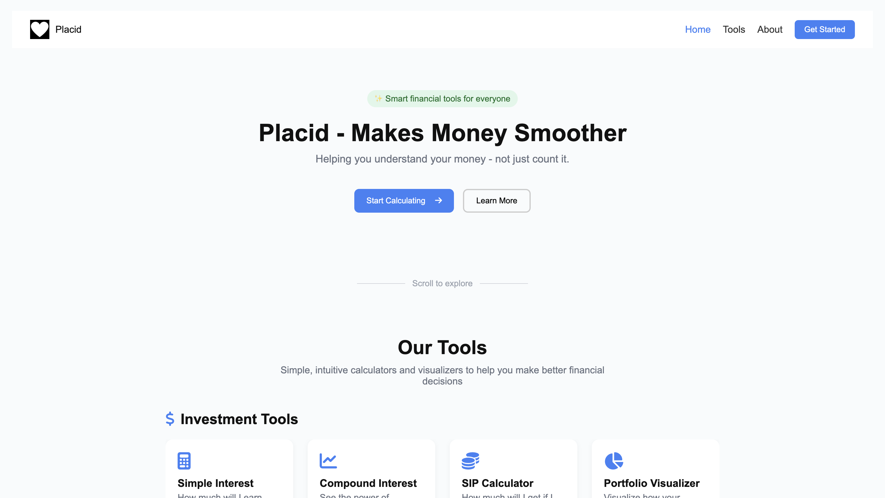
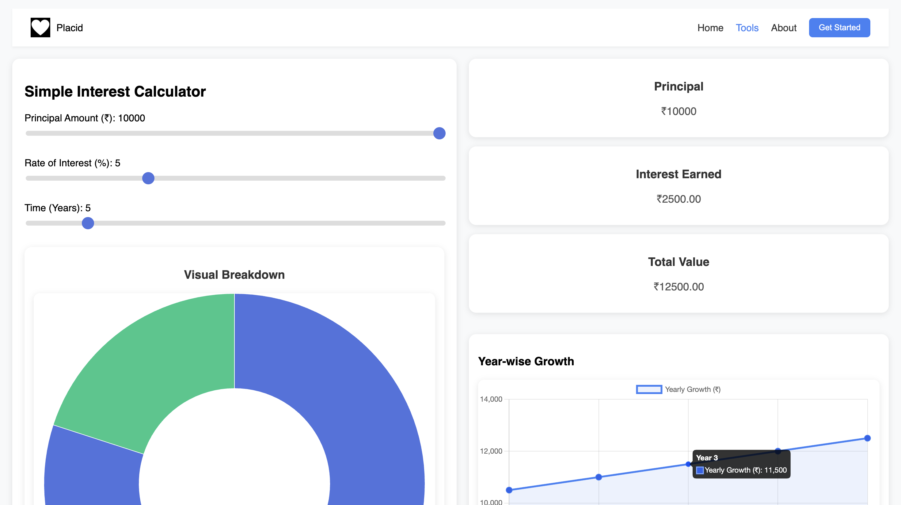
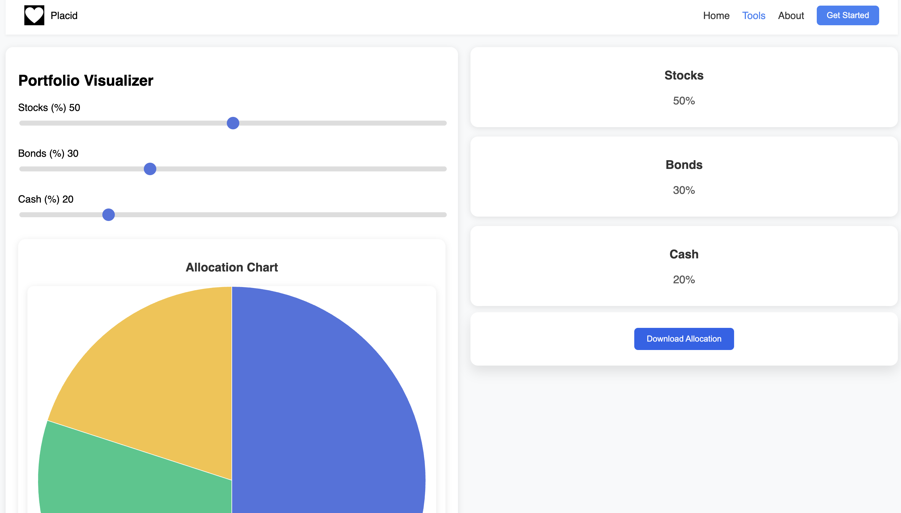

# 💸 Placid – Makes Money Smoother

**Live Site ➡️ [Placid – Launch Now](https://urooj-vx.github.io/Placid-Makes-Money-Smoother/)**

Placid is a beautiful, beginner-friendly financial toolkit built with 💛 vanilla HTML, CSS, JavaScript, and [Chart.js](https://www.chartjs.org/). Whether you're just starting out with personal finance or looking for fast, visual insights — Placid is your go-to open-source platform.

---

## ⚡ Why Placid?

Finance is scary — but it doesn’t have to be.

Placid simplifies complex financial concepts into intuitive calculators, clean charts, and interactive tools. No ads, no logins, no tracking — just pure financial clarity, accessible to everyone.

This is not just a project. This is the start of a **brand**, a future **company**, and a community-driven **mission** to empower financial literacy — starting from the basics.

---

## 🧰 Tools Included

Placid currently includes:

- 🧮 **Simple Interest Calculator**
- 📈 **Compound Interest Calculator**
- 💸 **SIP (Systematic Investment Plan) Calculator**
- 📊 **Portfolio Visualizer Tool**
- 🏠 **HRA (House Rent Allowance) Calculator**
- 🧾 **GST Calculator**
- 📉 **Capital Gains Calculator**
- 🧮 **Income Tax Calculator**

> 🚀 Upcoming: A blog section filled with beginner-friendly, jargon-free articles about scary financial topics — to empower absolute beginners with real financial literacy.

---

## ✨ Features

- ✅ Clean, minimal, and professional UI
- 📊 Beautiful, dynamic charts with Chart.js
- ♻️ Reusable shared logic and style files
- 💡 Beginner-friendly UX
- ⚙️ Open-source and easy to contribute to

---

## 📸 Sneak Peek

> A few screenshots from the live site:

---

## 🛠️ Built With

- HTML5
- CSS3
- JavaScript (Vanilla)
- [Chart.js](https://www.chartjs.org/)

---

## 👐 Contributing

Placid is an open-source passion project — and the future of it could be **you**. Whether you’re a beginner or a seasoned dev, your contribution can shape the future of financial tools.

### Want to contribute?
- Fork the repo
- Clone it
- Create a new branch
- Submit a PR 🙌

---

## 📜 License

This project is licensed under the [MIT License](/LICENCE) — meaning it's free to use, modify, and distribute. Just give proper credit. Perfect for open development.

---

## 🙌 A Word From the Creator

> “Placid isn't just a website — it’s my vision of turning financial literacy into something simple, visual, and accessible for everyone. I’m building this as a brand, and you're invited to grow with it.” — *Urooj*

---

## 🌐 Connect

If you're a developer, designer, or a finance enthusiast who believes in this vision, let's collaborate!

> ⭐ Star the repo, share it, or contribute to shape a better financial web for beginners.

